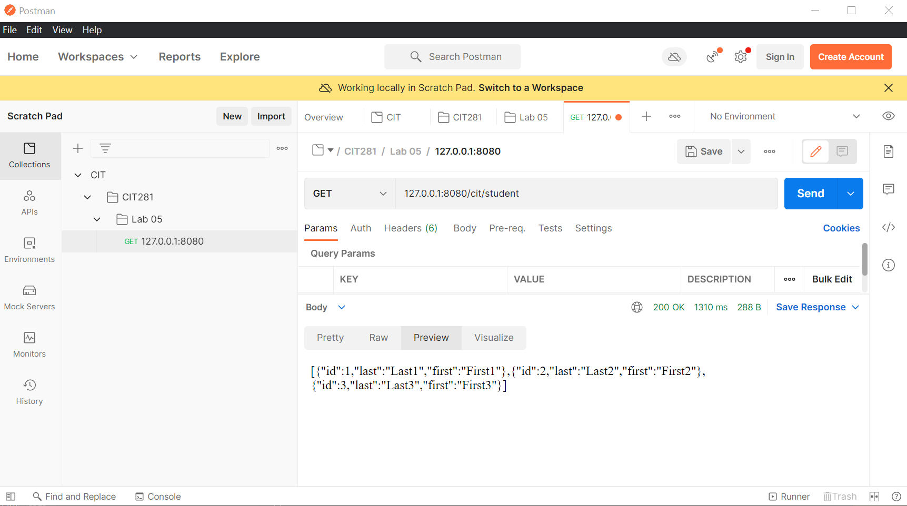
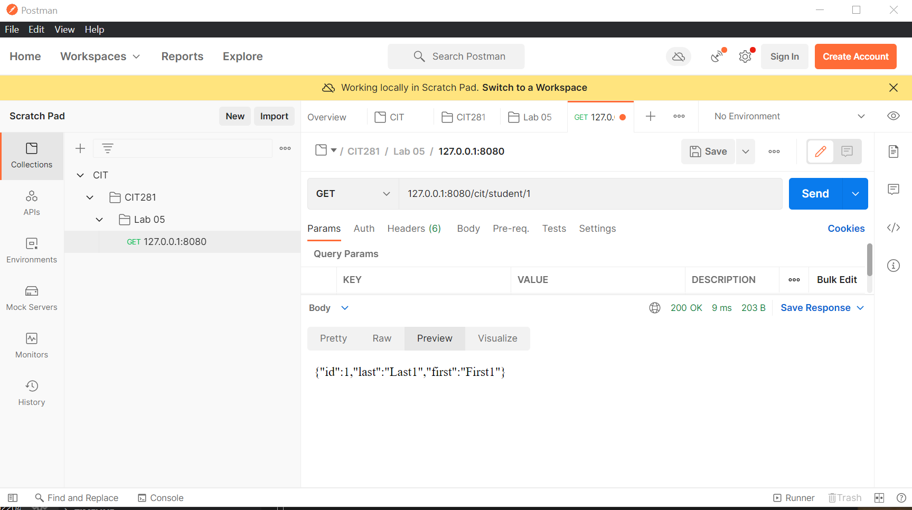
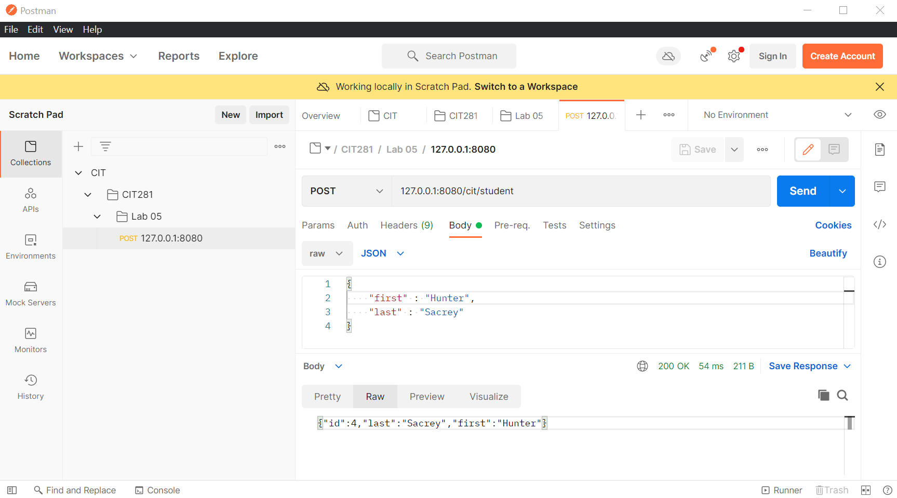

## Project 4

Working with Postman, I created a REST API that works with a "data" source of questions and answers. I created all of the code to work with the data source using a code module, and to test the code module code using provided testing code. 

I also created a Node.js REST API to handle the GET and POST verbs. 





#### p4-data.js:
```javascript

// Question and answer data array
const data = [
    {
      question: "Q1",
      answer: "A1",
    },
    {
      question: "Q2",
      answer: "A2",
    },
    {
      question: "Q3",
      answer: "A3",
    },
  ];
  
  // Export statement must be below data declaration - no hoisting with const
  module.exports = {
    data,
  };
```
#### p4-module.js:
```javascript
//Importing the data from p4-data.js
const { data } = require("./p4-data.js");
module.exports = {
  getQuestions,
  getAnswers,
  getQuestionsAnswers,
  getQuestion,
  getAnswer,
  getQuestionAnswer
};
//Returns array of just question strings from data object
function getQuestions() {
  const questions = [];
  for (i = 0; i < data.length; i++) {
    questions.push(data[i].question);
  }
  return questions;
}
//Returns array of just answer strings from data object
function getAnswers() {
  const answers = [];
  for (i = 0; i < data.length; i++) {
    answers.push(data[i].answer);
  }
  return answers;
}
//Return both questions and answers, I'm ~pretty~ sure I cloned them properly
function getQuestionsAnswers() {
  const qa = [];
    for (i = 0; i < data.length; i++) {
      let question = data[i].question;
      let answer = data[i].answer;
      qa.push({question, answer});
    }
  return qa;
}
//Returns a question object with {question(string), number(int), error(string)} (and errors if not)
function getQuestion(number = "") {
  const o = { question: "", number: number, error: "" };
  //ERR: No number
  if (o.number === 0){
    o.error += "Question number must be >= 1";
    return o;
  }
  if(!Number.isInteger(o.number)){
    o.error += "Question number must be an integer";
    return o;
  }
  //Searches through 'data' to find the question that matches the given 'number'
  for(i = 0; i < data.length; i++){
    if(data[i].question.includes(number)){
      o.question = data[i].question;
    }
  }
  if(data.length < o.number){
    o.error += `Question number must be less than the number of questions (${data.length})`;
  }
  return o;
}
//Returns an answer object matching the number (and errors if not)
function getAnswer(number = "") {
  const o = { question: "", answer: "", number: number, error: "" };
  //error: No number
  if (o.number === 0){
    o.error += "Question number must be >= 1";
    return o;
  }
  if(!Number.isInteger(o.number)){
    o.error += "Question number must be an integer";
    return o;
  }
  //Searches through 'data' to find the answer that matches the given 'number'
  for(i = 0; i < data.length; i++){
    if(data[i].answer.includes(number)){
      o.answer = data[i].answer;
    }
  }
  if(data.length < o.number){
    o.error += `Answer number must be less than the number of questions (${data.length})`;
  }
  return o;
}
function getQuestionAnswer(number = "") {
  const o = { question: "", answer: "", number: number, error: "" };
  //error: No number
  if (o.number === 0){
    o.error += "Question number must be >= 1";
    return o;
  }
  if(!Number.isInteger(o.number)){
    o.error += "Question number must be an integer";
    return o;
  }
  //Searches through 'data' to find the question and answer which include the given 'number'
  for(i = 0; i < data.length; i++){
    if(data[i].question.includes(number)){
      o.question = data[i].question;
    }
    if(data[i].answer.includes(number)){
      o.answer = data[i].answer;
    }
  }
  //error: No question + answer
  if(data.length < o.number){
    o.error += `Question/Answer number must be less than the number of questions (${data.length})`;
  }
  return o;
}
```
#### p4-server.js:
```javascript
const fastify = require("fastify")();

const {getQuestions, getAnswers, getQuestionsAnswers, getQuestion, getAnswer, getQuestionAnswer} = require("./p4-module.js");
//Returns all questions
fastify.get("/cit/question", (request, reply) => {
    const response = {error: "", statusCode: 200, questions: JSON.parse(JSON.stringify(getQuestions()))};
    reply
    .code(200)
    .header("Content-Type", "application/json; charset=utf-8")
    .send(response);
});
//Returns all answers
fastify.get("/cit/answer", (request, reply) => {
    const response = {error: "", statusCode: 200, answers: JSON.parse(JSON.stringify(getAnswers()))};
    reply
    .code(200)
    .header("Content-Type", "application/json; charset=utf-8")
    .send(response);
});
//Returns all questions and answers
fastify.get("/cit/questionanswer", (request, reply) => {
    const response = {error: "", statusCode: 200, questions_answers: JSON.parse(JSON.stringify(getQuestionsAnswers()))};
    reply
    .code(200)
    .header("Content-Type", "application/json; charset=utf-8")
    .send(response);
});
//Return a specific question
fastify.get("/cit/question/:number", (request, reply) => {
    const number = parseInt(request.params.number);
    
    const response = {error: "", statusCode: 200, question: JSON.parse(JSON.stringify(getQuestion(number).question)), number: number};
    if(getQuestion(number).error != ""){
        response.error = getQuestion(number).error;
    }
    reply
    .code(200)
    .header("Content-Type", "application/json; charset=utf-8")
    .send(response);
});
//Return a specific answer
fastify.get("/cit/questionanswer/:number", (request, reply) => {
    const number = parseInt(request.params.number);
    
    const response = {error: "", statusCode: 200, question: JSON.parse(JSON.stringify(getQuestion(number).question)), answer: JSON.parse(JSON.stringify(getAnswer(number).answer)), number: number};
    if(getAnswer(number).error != ""){
        response.error = getAnswer(number).error;
    }
    reply
    .code(200)
    .header("Content-Type", "application/json; charset=utf-8")
    .send(response);
});
//Return a specific question-answer
fastify.get("/cit/answer/:number", (request, reply) => {
    const number = parseInt(request.params.number);
    
    const response = {error: "", statusCode: 200, answer: JSON.parse(JSON.stringify(getAnswer(number).answer)), number: number};
    if(getAnswer(number).error != ""){
        response.error = getAnswer(number).error;
    }
    reply
    .code(200)
    .header("Content-Type", "application/json; charset=utf-8")
    .send(response);
});
fastify.get("*", (request, reply) => {
    const response = {error: "Route not found.", statusCode: 404};
    reply
    .code(404)
    .header("Content-Type", "application/json; charset=utf-8")
    .send(response);
});
const listenIP = "localhost";
const listenPort = 8080;
fastify.listen(listenPort, listenIP, (err, address) => {
    if (err) {
      console.log(err);
      process.exit(1);
    }
    console.log(`Server listening on ${address}`);
});
```
